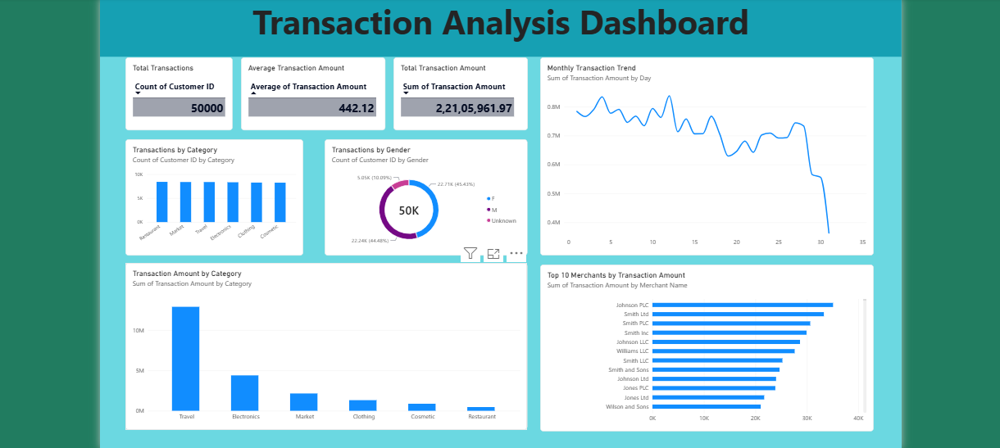

# SWYNEX - Interactive Dashboard

## Project Overview

This project presents an interactive Transaction Analysis Dashboard created using Power BI.

The dashboard provides a clear visual analysis of customer transactions, transaction amounts, categories, gender distribution, monthly trends, and top merchants.

The dashboard was created using the cleaned dataset prepared in Task 1.

## Dashboard Features

The dashboard includes the following key visualizations:

- Total Transactions
- Average Transaction Amount
- Total Transaction Amount
- Transactions by Category
- Transactions by Gender
- Monthly Transaction Trend
- Transaction Amount by Category
- Top 10 Merchants by Transaction Amount

## Key Performance Indicators (KPIs)

- **Total Transactions:** 50,000
- **Average Transaction Amount:** 442.12
- **Total Transaction Amount:** 2,21,05,961.97

## Tools Used

- Power BI
- Microsoft Excel
- GitHub

## Dataset

The dashboard uses the cleaned transaction dataset prepared during **Task 1: Data Cleaning & Preparation**.

The dataset contains customer and transaction information, including:

- Customer ID
- Name
- Surname
- Gender
- Birthdate
- Transaction Amount
- Date
- Merchant Name
- Category

## Dashboard Preview

## Project Outcome

The dashboard helps identify transaction patterns, category-wise performance, gender distribution, monthly transaction trends, and the top merchants based on transaction amount.

It provides an interactive and easy-to-understand visual representation of the cleaned transaction data.
